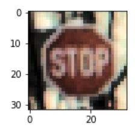
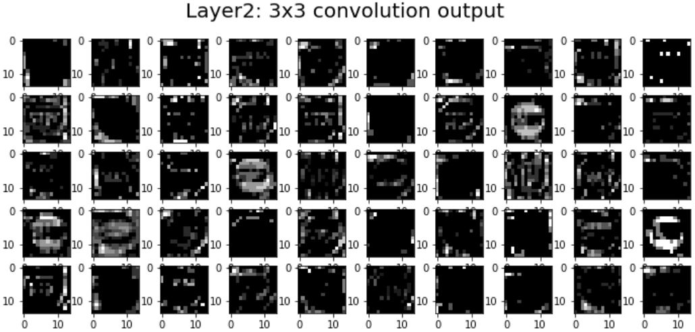
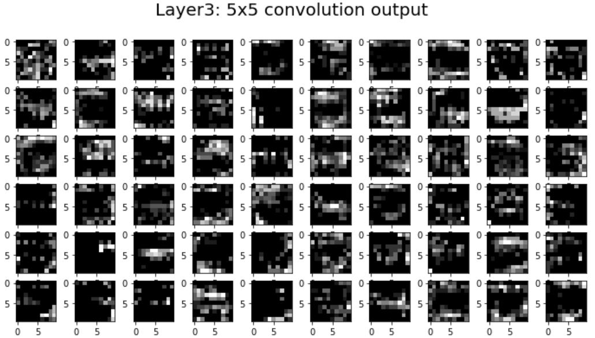

# **Traffic Sign Recognition**

  

here is a link to my [project code](https://github.com/Ryuta-S/traffic_sign_classifier/blob/master/Traffic_Sign_Classifier.ipynb)
---

**Build a Traffic Sign Recognition Project**

The goals / steps of this project are the following:
* Load the data set (see below for links to the project data set)
* Explore, summarize and visualize the data set
* Design, train and test a model architecture
* Use the model to make predictions on new images
* Analyze the softmax probabilities of the new images
* Summarize the results with a written report

[//]: # (Image References)

[image1]: ./writeup_image/amount-each-class.jpg "Visualization"
[image2]: ./examples/grayscale.jpg "Grayscaling"
[image3]: ./examples/random_noise.jpg "Random Noise"
[image4]: ./examples/placeholder.png "Traffic Sign 1"
[image5]: ./examples/placeholder.png "Traffic Sign 2"
[image6]: ./examples/placeholder.png "Traffic Sign 3"
[image7]: ./examples/placeholder.png "Traffic Sign 4"
[image8]: ./examples/placeholder.png "Traffic Sign 5"

---
### Each step for project.
#### 1. Dataset Summary & Exploration
I used the numpy library to calculate summary statistics of the traffic signs data set:
* The size of training set is 34799
* The size of validation set is 4410
* The size of test set is 12630
* The shape of a traffic sign image is (32, 32, 3)
* The number of unique classes/labels in the dataset is 43

#### 2. Exploratory visualization of the dataset
Here is a diagram visualizing the dataset. This is a histogram. It shows how many images each classes has. As you can see from here, there are wide variations in the number of sheets in each class.
![alt text][image1]

#### 3. Preprocessing and Augmentation
As a first step, I decided to convert the images to equalize the histogram of lightness because there are many dark images. I did this for every train, validation, test dataset. This is the normalization I did. The following shows the original image and converted image.

I decided to generate additional data because the number of images in each class varies. In order to eliminate this variation, I increased the number of images of that class when the number of data is less than 900 in class. I generate the data by rotation, expanding and shrinking.

Here is an example of an original and an augmented image:  

#### 4. Design and Test a Model Architecture
My model introduced the Inception Module. IN addition, my model includes global average pooling after the Inception Module. And I put 3 fully connected layers. Also, batch normalization is included in the middle.
My final model consisted of the following layers:

| branch1          | Description              | Main Layer       | Description              | breanch2        | Description            |
|:----------------:|:------------------------:|:----------------:|:------------------------:|:---------------:|:----------------------:|
|                  |                          | Input            | 32x32x3 RGB image				|                 |                        |
| layer1: Inception1(Conv5x5)| 1x1 stride, valid, out:28x28x10|  |                          | layer1: Inception2_1(Conv3x3)| 1x1 stride, valid, out:30x30x10 |
| layer1: RELU     | activation               |                  |                  				| layer1: RELU    | activation             |
| layer1: BN       | Batch Normalization      |                  |                  				| layer1: Inception2_2(Conv3x3)| 1x1 stride, valid, out:30x30x20 |
|         ↓        |             ↓            |                  |                  				| layer1: RELU    | activation             |
|         ↓        |             ↓            |                  |                  				| layer1: BN      | Batch Normalization    |
|                  |                          | layer1: Merge    | Merge inception1 and inception2, out: 28x28x30 |             |      |
| layer2: Inception1(Conv5x5)| 2x2 stride, same, out:14x14x50|   |                  				| layer2: Inception2(Conv3x3)| 2x2 stride, same, out:14x14x50  |
| layer2: RELU     | activation               |                  |                          | layer2: RELU    | activation             |
| layer2: BN       | Batch Normalization      |                  |                          | layer2: BN      | Batch Normalization    |
|                  |                          | layer2: Merge    | Merge inception1 and inception2, out: 14x14x100|             |      |
| layer3: Inception1(Conv5x5)| 1x1 stride, valid, out:10x10x120| |                          | layer3: Inception2_1(Conv3x3)| 1x1 stride, valid, out:12x12x100|
| layer3: RELU     | activation               |                  |                          | layer3: RELU    | activation             |
| layer3: BN       | Batch Normalization      |                  |                          | layer3: Inception2_2(Conv3x3)| 1x1 stride, valid, out:12x12x120|
|         ↓        |             ↓            |                  |                          | layer3: RELU    | activation             |
|         ↓        |             ↓            |                  |                          | layer3: BN      | Batch Normalization    |
|                  |                          | layer3: Merge    | Merge inception1 and inception2, out: 12x12x240|            |       |
|                  |                          | GAP              | Global Average Pooling out:240 |           |                        |
|                  |                          | layer4: Fully Connected  | input: 240, output: 150|           |                        |
|                  |                          | dropout          | dropout keep_prob: 0.75 or 0.5 |           |                        |
|                  |                          | layer5: Fully Connected  | input: 150, output: 100|           |                        |
|                  |                          | dropout          | dropout keep_prob: 0.75 or 0.5 |           |                        |
|                  |                          | output           | input: 100, output: 43         |           |                        |
|                  |                          | Softmax          | input: 43, output: 43          |           |                        |

The graph created with the tensorboard is shown [here](https://github.com/ryutaShitomi/traffic_sign_classifier/blob/master/writeup_image/model.png).

#### 5. Train the model.
To train the my model, I did a mini-batch gradient descent method. Since the number of augmentation train data is 53037, I choose the batch size to be the common multiple. And, epochs is 20. Hyper parameter values are shown below.

* When the accuracy for training data is 94% or less 
  learning rate: 0.1 
	BATCH_SIZE: 83

* When the accuracy for training data is 95% or greater 
  learning rate: 0.03 
	BATCH_SIZE: 83*9 

#### 4. Describe the approach taken for finding a solution and getting the validation set accuracy to be at least 0.93. Include in the discussion the results on the training, validation and test sets and where in the code these were calculated. Your approach may have been an iterative process, in which case, outline the steps you took to get to the final solution and why you chose those steps. Perhaps your solution involved an already well known implementation or architecture. In this case, discuss why you think the architecture is suitable for the current problem.

My final model results were:
* training set accuracy of 100%
* validation set accuracy of 96.9%
* test set accuracy of 95.7%

If an iterative approach was chosen:
* What was the first architecture that was tried and why was it chosen?
* First, I used the LeNet architecture.
* At that time, the accuracy for validation data and training data was very low. So, I thought that model is underfitting. I used an inception module with a 3x3 convolution layer and a 5x5 convolution layer.
* I used batch normalization.
* Using the Inception Module and BN, I achieved 93% accuracy for validation data.
* After that, I used Global Average Pooling based on GoogLeNet. By doing this, I achieved 96% accuracy.
* I used AdaGrad for the optmizer, butt I changed it to GradientDescent because the accuracy was reduced in certain point when I used AdaGrad.
* I inserted dropout layer in the fully connected layers and performed ensemble learning.

##### The difference in feature extraction by the Inception Module is shown below.
###### Example image

###### <u>layer1</u>

###### <u>layer2</u>

###### <u>layer3</u>

### Test a Model on New Images

#### 1. Choose five German traffic signs found on the web and provide them in the report. For each image, discuss what quality or qualities might be difficult to classify.

Here are five German traffic signs that I found on the web:

  

The last image might be difficult to classify because, when I look at the misclassified in the validation data, there are many mistakes in this sign.

#### 2. Discuss the model's predictions on these new traffic signs and compare the results to predicting on the test set. At a minimum, discuss what the predictions were, the accuracy on these new predictions, and compare the accuracy to the accuracy on the test set (OPTIONAL: Discuss the results in more detail as described in the "Stand Out Suggestions" part of the rubric).

Here are the results of the prediction:

| Image			        |     Prediction	        					|
|:---------------------:|:---------------------------------------------:|
| Ahead only      		| Ahead only    									|
| Keep right     			| Keep right 										|
| No entry 					| No entry											|
| Priority road	      		| Priority Road					 				|
| Right-of-way at the next intersection		| Right-of-way at the next intersection							|
| Roundabout mandatory                 | Roundabout mandatory  |

The model was able to correctly guess 5 of the 5 traffic signs, which gives an accuracy of 100%.
Compare with the accuracy on the test set, I got a good result. Also, looking at the misidentified image of the validation data, I found that there are many misidentified to the influence of color such as sunshine. So it may be improved it to grayscale and then creating model.

#### 3. Describe how certain the model is when predicting on each of the five new images by looking at the softmax probabilities for each prediction. Provide the top 5 softmax probabilities for each image along with the sign type of each probability. (OPTIONAL: as described in the "Stand Out Suggestions" part of the rubric, visualizations can also be provided such as bar charts)

The code for making predictions on my final model is located in the 28th cell of the Ipython notebook.

The following shows each image and Top 5 soft max probability. You can see that good predictions are made for all images.

